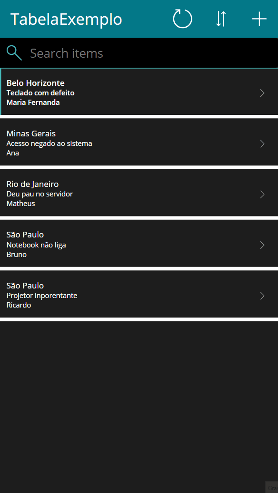
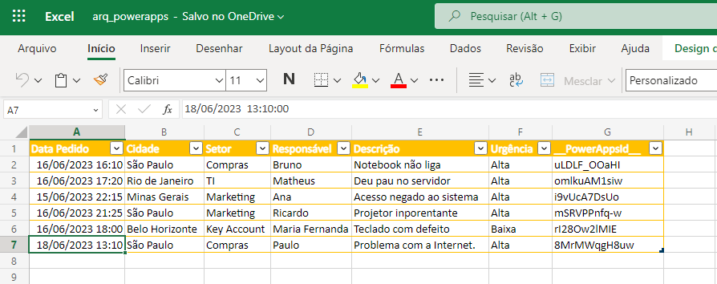

# Ordens_Servico_PowerApps
* Aplicativo Para Criação de Ordens de Serviço de uma empresa
* Feito e PowerApps e usando Ecxel como bancvo de dados

#
* Skills
    * PowerApps 📱
    * Excel 📊
#

    <h3>Formulário em Operação 📝</h3>
    

#

    <h3>Planilha 📊</h3>
    

 
